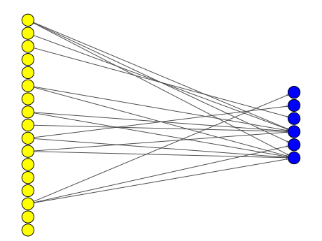

# Neuroevolution for Interpretable Policy

## Introduction
<div style="text-align: center;">
    
</div>

This is the result for [Interpretable Control Competition at GECCO 2024](https://giorgia-nadizar.github.io/interpretable-control-competition/). Specifcially, our policy can be expressed by the following formula, with the weights rounded to two decimal places:


This policy achieves an average score of 3300 over 1200 evaluations, using only 23 weights.

The structure of the final network. Yellow nodes represent input nodes, and blue nodes represent output nodes.
<div style="text-align: center;">
     
</div>

Detailed description are shown in [our report](./report.pdf).

## Test Our Policy
Please check `./src/policy.ipynb` for testing the policy.

To simply check our policy and visualize the episode, you don't need to install any extra packages aside from the official environment.

To evaluate our policy extensively (1200 times), you need to install the following package:
```
psutil==5.9.8
```
This is used to assign processes to different CPU cores for parallel evaluation.

## Train the Network and Transform it to an Interpretable Policy
We use the NeuroEvolution of Augmenting Topologies (NEAT) algorithm to search for optimal topologies and weights for the problem. Specifically, we use [tensorneat](https://github.com/EMI-Group/tensorneat), a NEAT implementation designed for hardware acceleration. The details of the training process are introduced in our report.

The following additional Python packages are required for these steps:
```
jax==0.4.13
jaxlib==0.4.13
networkx==3.1
matplotlib==3.7.5
sympy==1.12.1
psutil==5.9.8
```
The CPU version of JAX is sufficient.

### Training
Please check `./src/train.py` for training the network.

### Transforming the Trained Network to an Interpretable Policy
Please check `./src/generate_policy_from_network.ipynb` for transforming the trained network into an interpretable policy.
